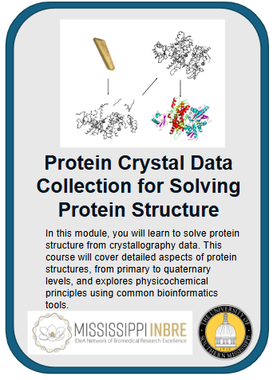
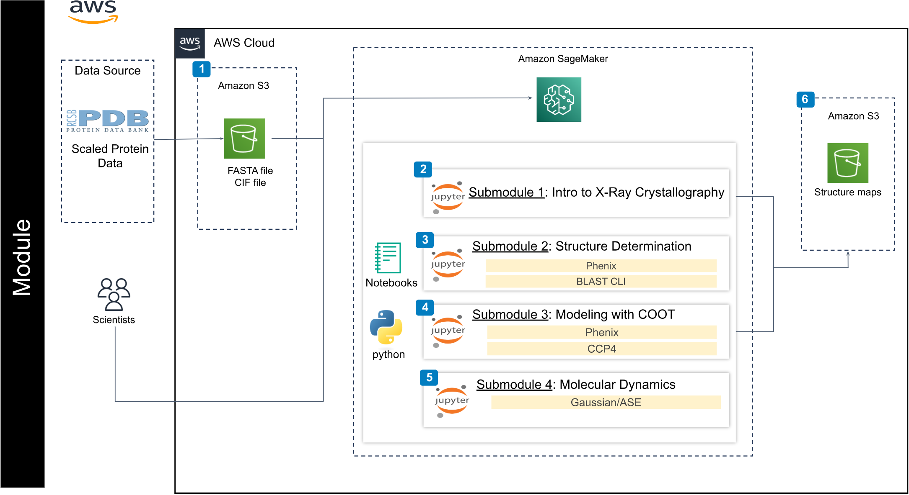

     
# 
 **X-Ray Crystallography & Molecular Energies** 

### 
 **Authors: Dr. Christopher Jurgenson and Dr. Joseph Bentley** 

---

## Contents

+ [Overview](#Overview)
+ [Background](#Background)
+ [Before Starting](#Before-Starting)
+ [Getting Started](#Getting-Started)
+ [Software Requirements](#Software-Requirements)
+ [Architecture Design](#Architecture-design)
+ [Data](#Data)
+ [Funding](#Funding)
+ [License for Data](#License-for-Data)

## Overview

This cloud-based learning module teaches x-ray crystallography and molecular energy basics. The x-ray crystallography tutorial will be carried out threw the Phenix software. After going through this the user should be comfortable with the process of determining the protein structure. Additionally, the user should be comfortable with basic quantum chemistry concepts used to perform biochemistry modeling.

The course is structured in four submodules, allowing us to:
1. Gain a basic understanding of proteins and x-ray diffraction/crystallography
2. Solve protein structure using SAD/MAD phasing in Phenix
3. Solve protein structure using molecular replacement in Phenix
4. Carry out protein modeling using COOT

The course content is organized in Jupyter Notebooks. The first three notebooks cover x-ray crystallography while the fourth discusses the quantum nature of molecular interactions.

The overall structure of the modules is explained below:

+ [**Submodule 0**](submodule_0_Phenix.ipynb): Used to launch the Phenix GUI
+ [**Submodule 1**](submodule_1_protein_crystallography_background.ipynb): Provides fundamentals of protein structure and x-ray crystallography. 
+ [**Submodule 2**](submodule_2_solving_protein_structure.ipynb):  Solving protein structure using SAD/MAD phasing and Molecular replacement methods.
+ [**Submodule 3**](submodule_3_protein_modeling_COOT.ipynb): Perform protein modeling using coot. 
+ [**Submodule 4**](submodule_4_molecular_interactions.ipynb): Aims to introduce basics of molecular energies providing basics of schrodingers equation and quantum chemistry.

## Background

X-ray crystallography and molecular dynamics are two essential tools in the field of structural biology that provide valuable insights into the three-dimensional structure and dynamic behavior of proteins. X-ray crystallography is an experimental technique that involves growing protein crystals, exposing them to X-ray beams, and analyzing the resulting diffraction patterns to determine the precise atomic positions within the protein. This technique has been instrumental in elucidating the structures of countless proteins, including enzymes, receptors, and other drug targets. On the other hand, molecular dynamics is a computational method that simulates the motion and interactions of atoms within a protein over time, based on the principles of classical mechanics and empirical force fields. By capturing the dynamic nature of proteins, molecular dynamics simulations can reveal important information about protein flexibility, conformational changes, and ligand binding, which are crucial for understanding protein function and designing effective drugs.

## Before Starting 
These tutorials are designed to run on AWS with the notebooks running within SageMaker AI notebooks. Before starting please gain access to an AWS account which you will be able to run SageMaker. 

## Getting Started 

    
 Setting Up AWS 

    
**1. Setting Up an AWS SageMaker Notebook Instance**
- Log in to AWS Management Console:
    - Navigate to the AWS SageMaker Console (Find **Amazon SageMaker AI** in the Services, or search it in the search bar)
- Create a SageMaker Notebook Instance:
    - Click **Notebooks**" in the left navigation pane (under Applications and IDEs, in Amazon SageMaker AI).
    - Click "**Create notebook instance**" at the top of the Notebook instances.
    - Fill out the following details:
        - Notebook instance name: Provide a unique name (e.g., notebook-yourname-date).
        - Instance type: Choose **ml.t3.medium** (or a larger instance type if your dataset is large, [more examples](https://docs.aws.amazon.com/sagemaker/latest/dg/notebooks-available-instance-types.html).
        - Click "**Addtional configurations**"
            - Lifecycle Configuration (Optional): Add a script to install any additional dependencies automatically.
            - **Volumne size in GB**: change it to **25**
        - IAM Role: If you don’t have an existing role, create a new one with S3 full access and AmazonSageMakerFullAccess permissions.
- Start the Notebook Instance:
    - Click "**Create notebook instance**" and wait for the status to change to "InService".

**2. Cloning the Tutorials Repository**
- Open the Notebook Instance:
    - Once the instance is active, click "Open JupyterLab" to access the notebook.
- Clone the Repository:
    - Open a terminal from the Jupyter interface.
    - Run the following command:
        - <code>**cd SageMaker**</code>
        - <code>**git clone https://github.com/STRIDES-Codes/dsu-nigms-protein-structure.git**</code>
    - This will create a folder containing all tutorial files.

 Registering For Phenix Account

    Submodule 2/3 uses Phenix and in order to access Phenix you must register for an account. 
    <li>
    Submit 
    <a href="https://docs.aws.amazon.com/sagemaker/latest/dg/notebooks-available-instance-types.html">Phenix Registration</a> form. 
    </li>
    <li>Once you have submitted the download request form wait for an email response notifying you that you can download Phenix.  </li>

  
## Software Requirements

For submodule 1, you can install all necessary requirements using the instructions in submodule 4, and the detailed software versions used in this tutorial are listed here:
 - `python 3.10.16`
 - `pandas 1.5.3`
 - `IPython 8.34.0`
 - `ipywidgets 8.1.5`

For submodule 2/3 Phenix is used 

 - `Phenix version 1.1.4`
 - `COOT 1.1.14`

For submodule 4, you can install all necessary requirements using the instructions in submodule 4, and the detailed software versions used in this tutorial are listed here:
 - `python 3.10.16`
 - `pandas 1.5.3`
 - `numpy 1.26.4`
 - `matplotlib 3.10.1`
 - `scipy 1.15.2`
 - `IPython 8.34.0`
 - `ipywidgets 8.1.5`
 - `ase 3.24.0`

## Architecture Design

## Data

## Funding

This work was fully supported by NIH NIGMS. Any opinions, findings, conclusions, or recommendations expressed in this material are those of the authors and do not necessarily reflect the views of the funding agencies.

## **License for Data**
Text and materials are licensed under a Creative Commons CC-BY-NC-SA license. The license allows you to copy, remix, and redistribute any of our publicly available materials, under the condition that you attribute the work (details in the license) and do not make profits from it.

This work is licensed under a [Creative Commons Attribution-NonCommercial-ShareAlike 4.0 International License](https://creativecommons.org/licenses/by-nc-sa/4.0/)

